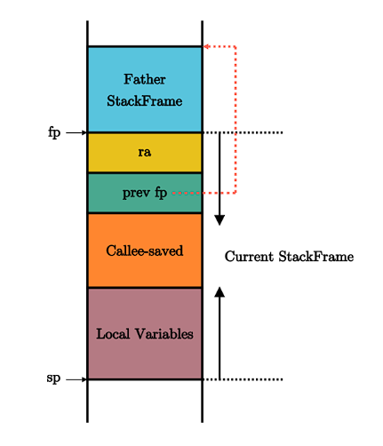

函数调用的跳转与单纯的跳转不同，在RISC-V架构上，有两条函数调用跳转指令：

| 指令                    | 指令功能                                   |
| ----------------------- | ------------------------------------------ |
| `jal rd, imm[20:1]`     | `rd ← pc + 4` `pc ← pc + imm`          |
| `jalr rd, (imm[11:0])rs`| `rd ← pc + 4` `pc ← rs + imm`          |

> RISC-V指令各部分含义 
> `rs`表示源寄存器，`imm`表示立即数，二者构成指令的输入部分；`rd`表示目标寄存器，是指令的输出部分。`rs`和`rd`可以在32个通用寄存器`x0~x31`中选取。在RISC-V架构中，通常使用`ra`（即`x1`寄存器）作为`rd`对应的寄存器

在函数调用时，通过`jalr`指令保持返回地址并实现跳转。

在函数返回时则使用一条汇编伪指令跳转回调用前的位置：`ret`，它会被汇编器翻译为`jalr x0, 0(x1)`，含义为跳转到寄存器`ra`保存的物理地址。

但如果遇到嵌套函数调用的情况，则需要额外保证`ra`寄存器的值不能变化。

> **函数调用上下文** 
> 由于函数调用，在控制流转移前后需要保持不变的寄存器集合。又分为被调用者保存寄存器`Callee-saved`和调用者保存寄存器`Caller-saved`。

这两段保护和恢复寄存器的汇编代码会由编译器自动插入，来完成相关寄存器的保存与恢复。

> **调用规范** 
> 调用规范约定在某个指令集架构上，某种编程语言的函数调用如何实现。包括： 
> 1. 函数的输入参数和返回值如何传递
> 2. 函数调用上下文中调用者/被调用者保存寄存器的划分
> 3. 其他在函数调用流程中对寄存器的使用方法

寄存器保存在栈中，`sp`寄存器常用来保存栈指针，指向内存中栈顶地址。在一个函数中，起始代码负责分配一块新的栈空间，把`sp`的值减少相应值，这块物理地址区间对应的物理内存称为这个函数的栈帧（Stack Frame），所有函数的栈帧串起来就组了一个完整的函数调用栈。

开头和结尾分别在`sp(x2)`和`fp(s0)`所指向的地址，按照地址从高到低分别有以下内容：
- `ra`寄存器保存其返回之后的跳转地址，是一个被调用者保存寄存器；
- 父亲栈帧的结束地址`fp`，是一个被调用者保存寄存器；
- 其他被调用者保存寄存器`s1~s11`；
- 函数所使用到的局部变量。

我们只需要在初始化阶段完成栈的设置，即设置好栈指针`sp`寄存器，编译器会自动完成后面的函数调用相关机制的代码生成。分配启动栈空间的代码在`entry.asm`中。