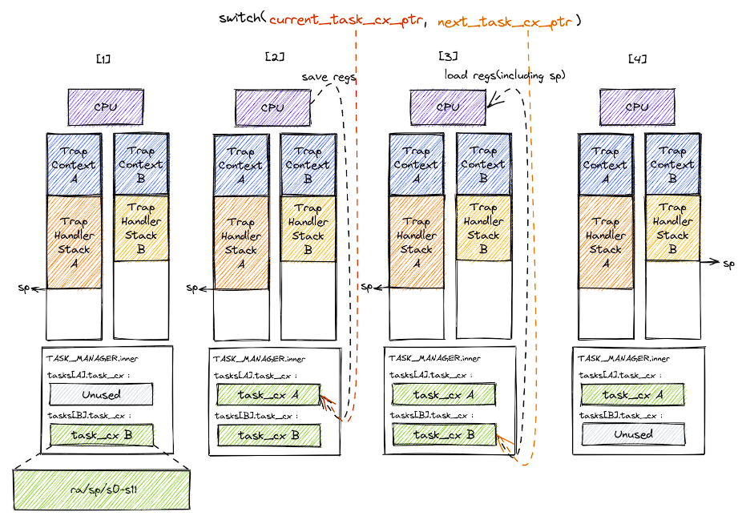

上面的MultiprogOS仅仅是能一次性加载所有程序，但依然需要逐个运行各个应用。这一章会建立任务的概念，实现任务切换机制。

我们把应用程序的一次执行过程称为一个任务，把应用执行过程中的一个时间片段上的执行片段或空闲片段称为“计算任务片”或“空闲任务片”。由于这次要实现程序之间的任务切换，因此需要操作系统进行任务上下文的保存和恢复。

任务切换实际上是两个应用在内核的`trap`控制流间的切换，当进入到`S`模式时，`trap`控制流可以调用`__switch`函数。这个函数返回后将继续从调用它的位置向下执行。

切换一共可以分为四个阶段：
- 在`trap`控制流A调用`__switch`前，A的内核栈上只有`trap`上下文和`trap`处理函数的调用栈
- A在A任务上下文空间里面保存CPU当前的寄存器快照
- 读取`next_task_cx_ptr`指向的B任务上下文，恢复`ra`、`s0~s11`、`sp`寄存器，通过`sp`换栈完成
- CPU执行`ret`汇编伪指令完成`__switch`返回，B任务从调用`__switch`的位置继续向下执行

`__switch`使用汇编代码实现。