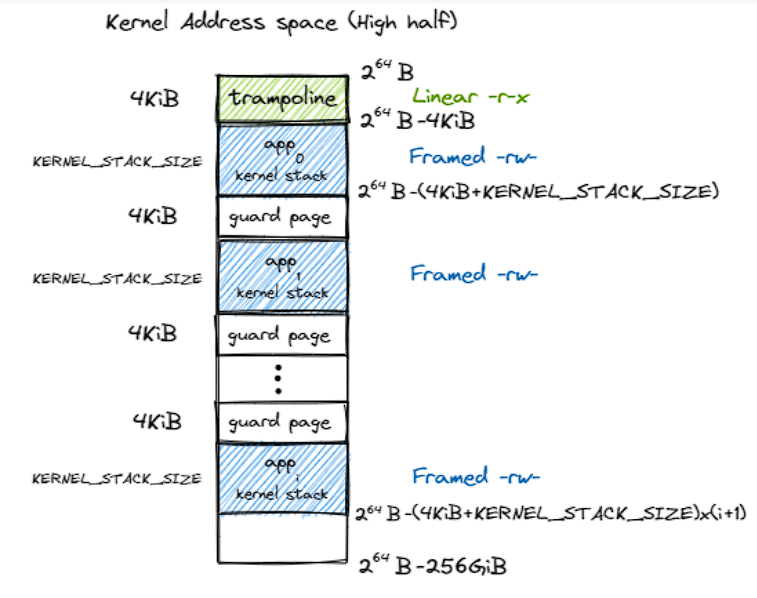
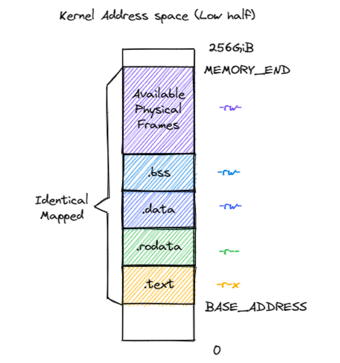
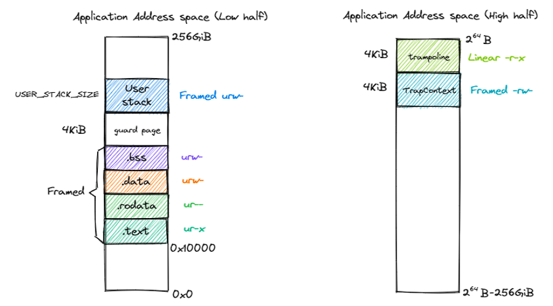

地址空间抽象的实现在`memory_set`中，这里主要介绍设计。

## 内核地址空间

由于SV39分页模式规定64位虚拟地址的`[63:39]`位必须与`38`位相同才能通过`MMU`检查，因此我们实际可用的地址范围是2^64 ~ 2^64-256GiB（第38位为1，高256）和256GiB ~ 0（第38位为0，低256）。

高256放置一个跳板（最高），以及下面从高到低放置每个应用的内核栈（与`xv6`设计类似），相邻两个内核栈用保护页面隔开。

低256布局如下：

内核的四个逻辑段`.text/.rodata/.data/.bss`被恒等映射到物理内存。低256的部分通过`os/src/linker-qemu.ld`进行分配。

而高256中的应用地址空间，在应用获取地址后通过`user/src/linker.ld`进行内部的空间分配。

