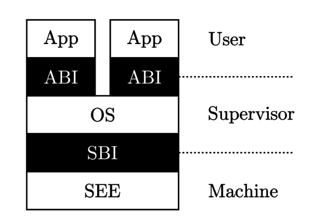

对应用程序而言，需要限制的主要有：
- 不能访问任意的地址空间
- 不能指向某些可能破坏计算机系统的指令

相关的RISC-V机器指令是：
`ecall`：执行环境调用指令，具有用户态到内核态的执行环境切换能力的函数调用指令。
`eret`：一类执行环境返回指令。其中`sret`具有内核态到用户态的执行环境切换能力的函数返回指令。

在RISC-V架构中，一共定义了4种特权级：

| 级别 | 编码 | 名称                             |
| ---- | ---- | -------------------------------- |
| 0    | 00   | 用户/应用模式 (U, User/Application) |
| 1    | 01   | 监督模式 (S, Supervisor)           |
| 2    | 10   | 虚拟监督模式 (H, Hypervisor)       |
| 3    | 11   | 机器模式 (M, Machine)              |

站在特权级架构的角度来看

RISC-V特权级规范定义的可能导致从低特权级到高特权级的各种异常：

| Interrupt | Exception Code | Description                     |
| --------- | -------------- | ------------------------------- |
| 0         | 0              | Instruction address misaligned  |
| 0         | 1              | Instruction access fault        |
| 0         | 2              | Illegal instruction             |
| 0         | 3              | Breakpoint                      |
| 0         | 4              | Load address misaligned         |
| 0         | 5              | Load access fault               |
| 0         | 6              | Store/AMO address misaligned    |
| 0         | 7              | Store/AMO access fault          |
| 0         | 8              | Environment call from U-mode    |
| 0         | 9              | Environment call from S-mode    |
| 0         | 11             | Environment call from M-mode    |
| 0         | 12             | Instruction page fault          |
| 0         | 13             | Load page fault                 |
| 0         | 15             | Store/AMO page fault            |

其中，Breakpoint和Environment call是通过在上层软件中执行一条特定的指令触发的，执行`ebreak`会触发断点陷入异常，执行`ecall`则会随CPU当前所处特权级触发不同的异常。

其中`ecall`是一类特殊的陷入类指令，相邻两特权级软件间的接口就是基于这种陷入机制实现的。M模式软件SEE和S模式的内核之间的接口被称为监督模式二进制接口SBI，内核与U模式之间的接口被称为应用程序二进制接口ABI（也即系统调用）。