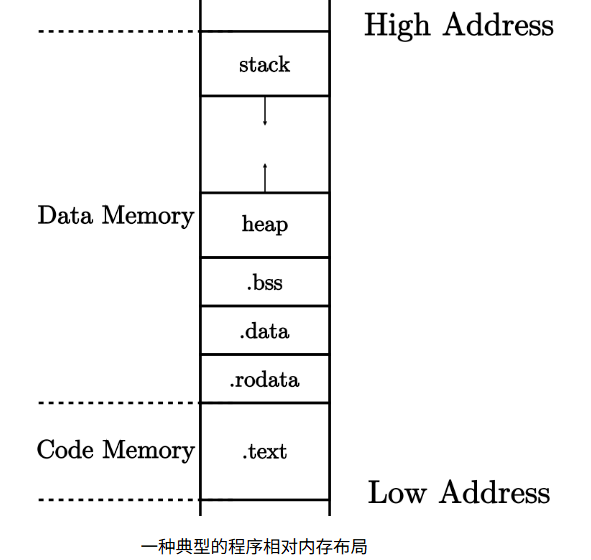

在编写之前，首先了解 QEMU 的启动流程：

在 QEMU 模拟的 `virt`硬件平台上，物理内存的起始地址为`0x80000000`，物理内存的默认大小为128MiB。QEMU在开始执行任何指令前，首先将作为 bootloader 的`rustabi-qemu.bin`加载到物理内存以物理地址`0x80000000`开头的区域上，同时将内核镜像`os.bin`加载到物理地址以`0x80200000`开头的区域上。然后的启动流程分三个阶段：
- 第一阶段：将必要的文件载入到 Qemu 物理内存之后，Qemu CPU 的程序计数器（PC, Program Counter）会被初始化为`0x1000`，因此 Qemu 实际执行的第一条指令位于物理地址`0x1000`，接下来它将执行数条指令并跳转到物理地址`0x80000000`对应的指令处并进入第二阶段。
- 第二阶段：由于 Qemu 的第一阶段固定跳转到`0x80000000`，需要将负责第二阶段的`bootloader rustsbi-qemu.bin`放在以物理地址`0x80000000`开头的物理内存中，这样就能保证`0x80000000`处正好保存 bootloader 的第一条指令。在这一阶段，bootloader 负责对计算机进行一些初始化工作，并跳转到下一阶段软件的入口，在 Qemu 上即可实现将计算机控制权移交给我们的内核镜像`os.bin`。
- 第三阶段：为了正确地和上一阶段的 RustSBI 对接，需要保证内核的第一条指令位于物理地址`0x80200000`处，即需要将内核镜像预先加载到 Qemu 物理内存以地址`0x80200000`开头的区域上。

在源代码编译成可执行文件后，它的一种典型的程序相对内存布局如下：



而链接器默认的内存布局不符合要求，因此为了与 QEMU 正确对接，需要自己编写链接脚本调整链接器的行为`os/src/linker.ld`。

链接脚本中：
- 首先设置目标平台为 RISC-V ，并设置程序入口点为`_start`函数，然后定义常量`BASE_ADDRESS`为内核的初始化代码的地址。
- 下面的`SECTION`则定义内存布局，先把当前地址设置为`BASE_ADDRESS`的地址，并标记为`skernel`，然后往下依次是`.text`代码段、`.rodata`只读数据段、`.data`数据段、`.bss`未初始化数据段，均保证 4KB 对齐

但这样编译得到的内核可执行文件还有一些多余的元数据，会导致实际用到的代码和数据段被加载到错误位置，因此需要用以下命令丢弃它们：

```bash
tinuvile@LAPTOP-7PVP3HH3:~/NimlothOS/os$ rust-objcopy --strip-all target/riscv64gc-unknown-none-elf/release/os -O binary target/riscv64gc-unknown-none-elf/release/os.bin

# 用stat工具来比较内核可执行文件与内核镜像的大小
tinuvile@LAPTOP-7PVP3HH3:~/NimlothOS/os$ stat target/riscv64gc-unknown-none-elf/release/os
  File: target/riscv64gc-unknown-none-elf/release/os
  Size: 9264            Blocks: 24         IO Block: 4096   regular file
Device: 820h/2080d      Inode: 219146      Links: 2
Access: (0755/-rwxr-xr-x)  Uid: ( 1000/tinuvile)   Gid: ( 1000/tinuvile)
Access: 2025-08-12 20:21:03.532637990 +0800
Modify: 2025-08-12 20:21:03.412638039 +0800
Change: 2025-08-12 20:21:03.422638034 +0800
 Birth: -
tinuvile@LAPTOP-7PVP3HH3:~/NimlothOS/os$ stat target/riscv64gc-unknown-none-elf/release/os.bin
  File: target/riscv64gc-unknown-none-elf/release/os.bin
  Size: 4               Blocks: 8          IO Block: 4096   regular file
Device: 820h/2080d      Inode: 219192      Links: 1
Access: (0755/-rwxr-xr-x)  Uid: ( 1000/tinuvile)   Gid: ( 1000/tinuvile)
Access: 2025-08-12 20:22:55.152597220 +0800
Modify: 2025-08-12 20:22:55.152597220 +0800
Change: 2025-08-12 20:22:55.152597220 +0800
 Birth: -
```

目前内核镜像的大小仅有四字节，因为它里面只有`entry.asm`中编写的一条指令。

```bash
tinuvile@LAPTOP-7PVP3HH3:~/NimlothOS/os$ qemu-system-riscv64 -machine virt -nographic -bios ../bootloader/rustsbi-qemu.bin -device loader,file=target/riscv64gc-unknown-none-elf/release/os.bin,addr=0x80200000 -s -S

tinuvile@LAPTOP-7PVP3HH3:~/NimlothOS/build$ riscv64-unknown-elf-gdb -ex 'file target/riscv64gc-unkn
own-none-elf/release/os' -ex 'set arch riscv:rv64' -ex 'target remote localhost:1234'
```